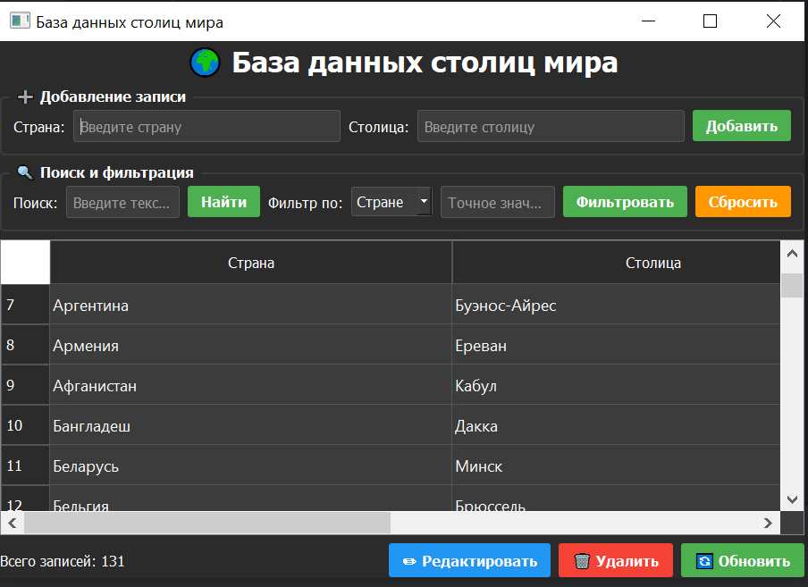

# Countries and Capitals

Приложение представляет
собой графический интерфейс для управления базой данных стран и их столиц с возможностью добавления, поиска, фильтрации,
редактирования и удаления записей.

## Запуск

Для начала необходимо установить внешние зависимости с помощью команды:

    $ pip install -r requirements.txt

После чего можно запустить `main.py`

На UNIX/Linux/MacOS:

    $ ./main.py

или

    $ python3 main.py

На Windows:

    $ python main.py

## Интерфейс

|             Главное окно             |
|:------------------------------------:|
|  |

### Главное окно

Главное окно содержит таблицу со всеми записями, а также панель управления.

|      Элемент       | Действие                                                     |
|:------------------:|:-------------------------------------------------------------|
|   **Добавление**   | Поля для ввода новой страны и столицы + кнопка "Добавить"    |
|     **Поиск**      | Поиск по частичному совпадению в названии страны или столицы |
|   **Фильтрация**   | Точная фильтрация по стране или столице                      |
| **Редактирование** | Изменение выбранной записи (страну, столицу или оба поля)    |
|    **Удаление**    | Удаление выбранной записи с подтверждением                   |
|    **Обновить**    | Сброс фильтров и обновление таблицы                          |

### Особенности работы

- При добавлении проверяется уникальность названия страны — дубликаты не допускаются.
- Поиск регистронезависимый, ищет вхождения подстроки.
- Фильтрация точная (строгое совпадение).
- Перед удалением запрашивается подтверждение.
- Редактирование возможно по одному или сразу по двум полям.

## ⚙️ Возможности

- Полноценное приложение с функциями Create, Read, Update, Delete;
- SQLite база данных с автоматическим созданием таблицы;
- Поиск и фильтрация записей;
- Удобный графический интерфейс на PyQt5;
- Использование ассемблерных вставок для вспомогательных операций.

## Архитектура проекта

- `main.py` — точка входа, запуск приложения.
- `main_window.py` — главное окно, логика взаимодействия с пользователем.
- `repository.py` — слой работы с базой данных.
- `db_wrapper.c` — C-обертка для вызова ассемблерных функций.
- `db_operations.S` — ассемблерные функции.
- `database/` — директория с SQLite базой данных.
- `asm/` — скомпилированная DLL с ассемблерным кодом.

## Особенности реализации

### 1. Слой репозитория

Все операции с базой данных вынесены в отдельный класс `CapitalRepository`, что обеспечивает:

- Инкапсуляцию SQL-запросов;
- Преобразование результатов в удобный формат (хеш-таблицы).

### 2. Гибкая система поиска и фильтрации

- **Поиск** использует оператор `LIKE` с подстановкой `%keyword%`, что позволяет находить частичные совпадения в любом
  месте строки.
- **Фильтрация** использует точное совпадение (`=`), что полезно для получения конкретной записи.

### 3. Динамическое построение UPDATE-запроса

Метод `update_capital` поддерживает обновление только одного поля или обоих сразу, динамически собирая SQL-запрос в
зависимости от переданных параметров.

### 4. Ассемблерные вставки

Для демонстрации низкоуровневых оптимизаций две вспомогательные функции реализованы на ассемблере x86-64.

## Ассемблерные функции

В проекте используются две ассемблерные функции, которые вызываются из Python через C-обертку.

### Файл `db_operations.S`

```assembly
.global check_rowcount
.global choose_field

# Функция 1: check_rowcount
# Проверяет, больше ли переданное значение нуля
# Вход: RCX = значение (например, rowcount из SQLite)
# Выход: RAX = 1 если значение > 0, иначе 0
check_rowcount:
    cmpq $0, %rcx      # сравниваем значение с 0
    jg positive        # если больше 0 -> переход на positive

    movq $0, %rax      # иначе возвращаем 0
    ret

positive:
    movq $1, %rax      # возвращаем 1
    ret

# Функция 2: choose_field
# Выбирает поле для WHERE-условия в UPDATE-запросе
# Вход: RCX = 1 если идентификатор — число (id), 0 если строка (country)
# Выход: RAX = 1 для id, 0 для country
choose_field:
    cmpq $0, %rcx      # сравниваем флаг с 0
    je use_country     # если 0 -> использовать country

    movq $1, %rax      # иначе использовать id
    ret

use_country:
    movq $0, %rax      # использовать country
    ret
   ```

|      Функция       | Назначение                                                                                                                                                                                                                |
|:------------------:|:--------------------------------------------------------------------------------------------------------------------------------------------------------------------------------------------------------------------------|
| **check_rowcount** | 	Принимает значение rowcount (количество затронутых строк) от SQLite и возвращает 1, если строки были изменены/удалены, и 0 в противном случае. Это позволяет корректно определить успешность операции UPDATE или DELETE. |
|  **choose_field**  | Принимает флаг: 1 (идентификатор — число id) или 0 (идентификатор — строка country). Возвращает соответствующий код, который используется при динамическом построении SQL-запроса для выбора поля в условии WHERE.        |

## Заключение

В ходе работы было разработано полноценное приложение для управления базой данных стран и их столиц. Реализованы все
операции: поиск, фильтрация, а также продемонстрировано взаимодействие Python с ассемблерным кодом через C-обертку.